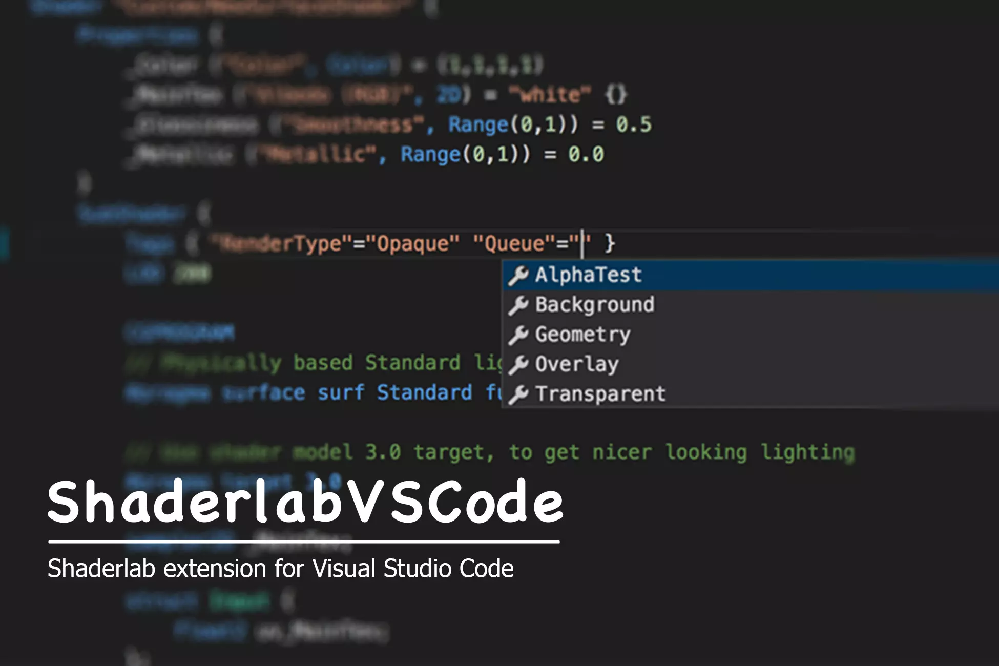

# ShaderlabVSCode 

ShaderlabVSCode is a Visual Studio Code extension for Unity Shaderlab progamming.

 <a href='http://forum.unity3d.com/threads/403471/'  target='_blank'> Forum </a> &nbsp;|&nbsp; <a href='mailto:amlovey@qq.com'> Email </a> &nbsp;|&nbsp; <a href='https://assetstore.unity.com/packages/slug/94653?aid=1011lGoJ'  target='_blank'> Purchase from Asset Store </a> &nbsp;|&nbsp; <a href='https://mianbaoduo.com/product/show/mbd-Yp2Ylw==>'  target='_blank'> Purchase from MianBaoDuo </a>
 
 

<iframe style="position: absolute;left:0;top:0;width:100%;height:100%" src="https://www.youtube.com/embed/d9ZNNEcZOOs" frameborder="0" allowfullscreen></iframe>

